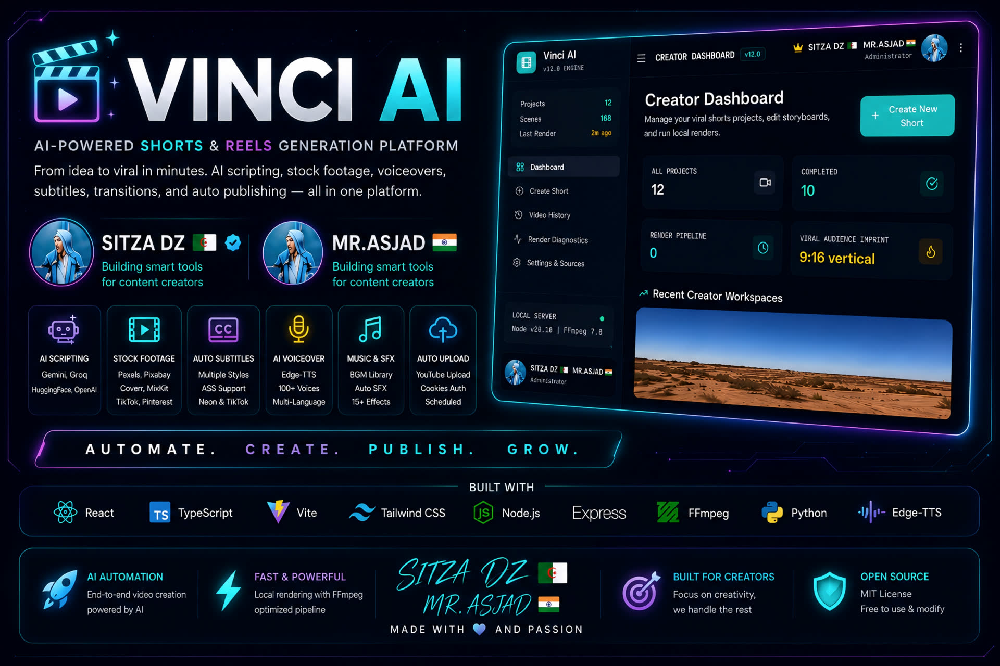

<p align="center">
  
</p>

# 🎬 Vinci AI — AI Shorts Generator

AI-powered YouTube Shorts / Reels video factory. Give it a **topic** — it writes the script (Gemini), generates a voiceover (Edge-TTS), fetches stock footage (TikTok/Pexels/Pixabay), adds subtitles + transitions + BGM + watermark, renders the video (FFmpeg), and **uploads it to YouTube automatically** — instantly or scheduled at the best posting time.

Includes **Autopilot Mode**: a hands-free factory that keeps generating and uploading videos on a schedule.

> Runs on **Termux (Android)**, **Windows**, or any Linux box · Protected by **PIN login** · Exposed publicly via **Cloudflare Tunnel**

---

## ✨ Features

| Feature | Description |
|---------|-------------|
| 🤖 **AI Scripting** | Gemini-powered scripts — tones, languages, Hindi Devanagari output |
| 🎥 **Auto Stock Footage** | TikTok (auto source + watermark blur), Pexels, Pixabay, quality filter |
| 📝 **Auto Subtitles** | Multiple styles (TikTok, Neon, Minimal…) + font size control |
| 🔊 **AI Voiceover** | Edge-TTS — 322 voices dropdown, rate slider (−50%…+50%), optional XTTS voice clone |
| 🎵 **Background Music** | Built-in BGM library + **upload your own MP3/WAV**, music ducking, beat sync |
| 🔀 **Transitions & Effects** | 15+ xfade transitions, color grade, Ken Burns, emoji overlays, AI thumbnail |
| 🏷️ **Watermark / CTA** | Logo upload + position/size, CTA end card |
| 📺 **YouTube Upload** | **OAuth-first** (official Data API v3), cookies fallback, instant or scheduled |
| 📆 **Smart Scheduler** | Best-posting-time prediction + manual date selection |
| 📺 **Multi-Channel** | Add 2+ YouTube channels, choose channel per upload |
| 🚀 **Autopilot Mode** | Hands-free: topics → videos → uploads on schedule (see below) |
| 🔐 **PIN Security** | Landing page PIN login (SHA-256), 30-day session |
| 🎨 **Instagram-style UI** | Day/night theme, Theme Studio |
| 📊 **Extras** | Batch mode, trends, analytics, video history, render diagnostics |

### 🚀 Autopilot Mode (hands-free factory)

- Category/Niche + Region
- **Generate Topic Ideas** (AI) or add topics manually
- **AI Title generation** — 4 options per topic, pick or write your own
- **All Video Features panel** — enable/disable every feature (9 sections, 40+ options)
- Videos/Day (1–6) · Duration (15/30/45/60s) · Edge-TTS voice + rate
- Default BGM picker + **Upload/Delete BGM**
- Target channel selection
- Approval modes: **Full Auto / Approve First / Manual Upload**
- **Upload Date selection** (date picker + Auto/Aaj/Kal) + per-video reschedule
- Smart status: **Active / Running (Manual) / Paused**

---

## 🛠️ Tech Stack

```
Frontend:   React 18 + TypeScript + Vite + Tailwind CSS + lucide-react + motion
Backend:    Express (TypeScript) → bundled with esbuild → dist/server.cjs
AI:         Google Gemini (@google/genai) — scripts, topics, titles
Voice:      Edge-TTS (322 voices) · optional XTTS voice clone (Colab)
Video:      FFmpeg (xfade, ASS subs, amix, watermark overlay)
Footage:    TikTok (urlebird + tiktok-api-dl), Pexels, Pixabay
YouTube:    Official Data API v3 (OAuth) primary · cookies/InnerTube fallback
Auth:       Single PIN (SHA-256) + 30-day session cookie
Storage:    JSON files (data/db.json) + filesystem (storage/)
Tunnel:     cloudflared named tunnel
```

---

## 📦 Installation

### Prerequisites

- **Node.js** v18+
- **FFmpeg** v6+ (libx264 + aac)
- **Python 3** + `pip` (for Edge-TTS)
- **Gemini API key** (free at https://aistudio.google.com)
- **Google Cloud OAuth credentials** (for YouTube upload — see setup below)

### Termux (Android)

```bash
pkg update && pkg upgrade
pkg install nodejs ffmpeg python git
pip install edge-tts

# TikTok search needs python3.13 + curl_cffi (optional)
pkg install python-cryptography   # if needed
```

### Windows

**1. Node.js** — install the LTS installer from https://nodejs.org (v18+). Verify in a new PowerShell:

```powershell
node -v
```

**2. FFmpeg** — either:

```powershell
winget install Gyan.FFmpeg
```

or download a release build from https://www.gyan.dev/ffmpeg/builds/, extract it (e.g. `C:\ffmpeg`), and add `C:\ffmpeg\bin` to your system **PATH** (Settings → System → About → Advanced system settings → Environment Variables → edit `Path`). Verify:

```powershell
ffmpeg -version
```

**3. Python** — install from https://www.python.org/downloads/.
⚠️ On the first installer screen tick **"Add python.exe to PATH"** before clicking Install. Verify:

```powershell
python --version
```

**4. Edge-TTS** (voiceover engine):

```powershell
pip install edge-tts
```

**5. Get the project running:**

```powershell
git clone https://github.com/YOUR-USERNAME/ai-shorts-generator.git
cd ai-shorts-generator

npm install

copy .env.example .env
# open .env in Notepad and fill in your keys (see Configuration below)

npm run build
npm start
# → http://localhost:3000
```

> **Windows notes**
> - The app auto-detects `python` on Windows (Linux/Termux use `python3`). If your Python binary has a different name, set `PYTHON_BIN=...` in `.env`.
> - TikTok/Pinterest search (optional) additionally needs `pip install curl_cffi`.
> - In PowerShell use `Copy-Item .env.example .env` instead of `copy`.
> - Keep the PowerShell window open while the server runs; `Ctrl+C` stops it.
> - Firewall may ask to allow Node.js on first run — click **Allow** for private networks.

### Steps

```bash
# 1. Get the project
git clone https://github.com/YOUR-USERNAME/ai-shorts-generator.git
cd ai-shorts-generator

# 2. Install dependencies
npm install

# 3. Install Edge-TTS (voiceover engine)
pip install edge-tts

# 4. Environment setup
cp .env.example .env
# Edit .env and fill in your keys (see Configuration below)

# 5. Storage directories (auto-created, but just in case)
mkdir -p storage/projects storage/audio/builtin/bgm storage/audio/builtin/sfx \
         storage/audio/library storage/fonts storage/watermarks storage/stickers

# 6. Build
npm run build

# 7. Start (PRODUCTION)
npm start
# → http://localhost:3000
```

> ⚠️ **Always use `npm start`** (production build). Avoid `npm run dev` — dev mode reloads the page on every click.

---

## ⚙️ Configuration (.env)

```env
# REQUIRED — AI scripting
GEMINI_API_KEY="***"

# REQUIRED — encrypts API keys stored in the database (32 random chars)
ENCRYPTION_SECRET="replac…ring"

# Server
PORT=3000
APP_URL="http://localhost:3000"

# YouTube cookies-based fallback upload
YOUTUBE_FRONTEND_API_KEY="your-y…-key"

# YouTube OAuth (official API upload) — see setup guide below
YOUTUBE_CLIENT_ID="your-client-id.apps.googleusercontent.com"
YOUTUBE_CLIENT_SECRET="your-c…cret"
```

---

## 📺 YouTube OAuth Setup (step by step)

YouTube upload uses the **official Data API v3** (OAuth). One-time setup:

1. Go to **https://console.cloud.google.com** → create a project
2. **APIs & Services → Library** → enable **YouTube Data API v3**
3. **OAuth consent screen**:
   - User Type: **External**
   - Add your Google email as a **Test User**
   - Keep publishing status = **Testing** (personal use — no verification needed)
   - ⚠️ In Testing mode, refresh tokens expire after **7 days** (re-auth weekly, or publish to Production)
4. **Credentials → Create Credentials → OAuth client ID**:
   - Application type: **Web application**
   - Add **Authorized redirect URIs**:
     ```
     http://localhost:3000/api/youtube/callback
     https://YOUR-DOMAIN.com/api/youtube/callback
     ```
5. Copy **Client ID** + **Client Secret** into `.env`
6. Restart server → open **Settings → YouTube** → click **Connect** → sign in with your channel's Google account
7. Done — uploads now use the official API

### Multi-channel

Settings → **Add Another Channel** → repeat OAuth with a second Google account. At upload time (Project Details or Autopilot) you pick which channel to upload to.

---

## 🌐 Public Access (Cloudflare Tunnel)

To access the app from anywhere + get a stable OAuth redirect URI:

```bash
# Install
pkg install cloudflared   # or download from GitHub releases

# One-time: login + create named tunnel
cloudflared tunnel login
cloudflared tunnel create youtube-uploader

# Route your domain
cloudflared tunnel route dns youtube-uploader yt.yourdomain.com
```

`~/.cloudflared/config.yml`:

```yaml
tunnel: <TUNNEL_ID>
credentials-file: /path/to/<TUNNEL_ID>.json

ingress:
  - hostname: yt.yourdomain.com
    service: http://localhost:3000
  - service: http_status:404
```

```bash
cloudflared tunnel run youtube-uploader
```

Now `https://yt.yourdomain.com` → your app. Add this domain's callback URI in Google Cloud Console (step 4 above).

---

## 🎮 Usage & Full Workflow

### 1. First login

Open `http://localhost:3000` → landing page asks for a **PIN**.
First time: set your PIN in **Settings → Security**. PIN is stored SHA-256 hashed; session lasts 30 days.

### 2. Create a video manually

```
Create Video page
  ├─ Tab "Topic"  → type a topic, AI writes the script
  └─ Tab "Script" → paste your own script
Settings panel:
  ├─ Voice (322 Edge-TTS voices + rate slider)
  ├─ Subtitle style + font size
  ├─ Tone, language, transitions, effects
  ├─ BGM (built-in or uploaded)
  ├─ Watermark / CTA
  └─ Quality + footage sources
→ Render → Preview → Upload now OR Schedule
```

### 3. Upload / Schedule

- **Upload now** → goes straight to YouTube via OAuth
- **Schedule** → pick date/time, or let it pick the **best posting time** (trends-based)
- Choose the **target channel** if you have multiple connected

### 4. Autopilot Mode (hands-free)

```
Autopilot page
  1. Set Category/Niche + Region
  2. Add topics manually OR click "Generate Topic Ideas" (AI)
  3. (Optional) per topic: click Title → pick from 4 AI titles
  4. Configure: voice, BGM (+upload), duration, videos/day, target channel
  5. Open "All Video Features" panel → enable/disable everything
  6. Set Upload Date (Auto / Aaj / Kal / date picker)
  7. Choose approval mode: Full Auto | Approve First | Manual Upload
  8. Press "Run Now" (starts one video AND turns the engine ON)
     or toggle "Autopilot ON"
```

The background engine then:
- ticks every **90 seconds**
- tops up the queue from your topics
- processes the next video through the full pipeline
- respects your **videos/day** limit (YouTube quota ≈ 6/day)
- schedules each video on your chosen date at the best time
- the **scheduler** ticks every 60s and uploads anything due

Status card shows: **Active** (engine ON) · **Running (Manual)** (one-shot run in progress) · **Paused**.

### 5. Full pipeline (what happens per video)

```
Topic
 → Gemini writes script (tone/language aware)
 → script split into scenes
 → footage fetched per scene (TikTok/Pexels/Pixabay, dedup + quality filter)
 → Edge-TTS voiceover per scene
 → FFmpeg render: concat + subtitles + transitions + effects + BGM + watermark
 → MP4 ready
 → SEO title/description/hashtags (Gemini)
 → Upload via OAuth (cookies fallback) — instant or at scheduled time
 → success synced back to scheduler + Autopilot queue
```

---

## 📁 Project Structure

```
├── server.ts                    # Express app — ALL API routes
├── server/                      # backend modules
│   ├── aiManager.ts             # script/SEO orchestration
│   ├── autopilot.ts             # Autopilot engine (config, queue, tick)
│   ├── crypto.ts                # API-key encryption
│   ├── db.ts                    # JSON DB: projects, settings, auth
│   ├── ffmpeg.ts                # render pipeline
│   ├── gemini.ts                # Gemini: scripts, topics, titles
│   ├── providers.ts             # footage providers
│   ├── renderQueue.ts           # render job queue
│   ├── sceneVoice.ts            # Edge-TTS voices + TTS
│   ├── trends.ts                # best posting time prediction
│   ├── voiceClone.ts            # XTTS voice-clone client
│   ├── yt-accounts.ts           # multi-channel storage
│   └── yt-cookies-upload.ts     # cookies upload fallback
├── src/                         # React frontend
│   ├── App.tsx                  # view router
│   ├── types.ts                 # shared types/enums
│   └── components/
│       ├── LandingPage.tsx      # PIN login
│       ├── SaaSLayout.tsx       # app shell + sidebar
│       ├── DashboardView.tsx    # home
│       ├── CreateVideoView.tsx  # manual creation wizard
│       ├── ProjectDetailsView.tsx # editor + upload/channel chooser
│       ├── AutopilotView.tsx    # Autopilot Mode UI
│       ├── BatchView.tsx        # batch generation
│       ├── TrendsView.tsx       # trends / best times
│       ├── AnalyticsView.tsx    # analytics
│       ├── VideoHistoryView.tsx # history
│       ├── RenderDiagnosticsView.tsx
│       └── SettingsView.tsx     # security, OAuth channels, keys
├── data/                        # runtime data + secrets (gitignored)
│   ├── db.json                  # projects, settings, PIN, sessions
│   ├── autopilot.json           # Autopilot config
│   ├── autopilot-queue.json     # Autopilot queue
│   ├── youtube-accounts.json    # multi-channel OAuth tokens
│   └── youtube-cookies.txt      # cookies fallback
├── storage/                     # media (gitignored)
│   ├── audio/builtin/           # built-in BGM + SFX
│   ├── audio/library/           # user-uploaded music
│   ├── projects/                # per-project media + renders
│   └── fonts/ stickers/ watermarks/ previews/
├── colab/                       # XTTS voice-clone notebooks
├── urlebird_search.py           # TikTok hashtag search
├── .env                         # secrets (NEVER share)
└── dist/                        # build output
```

---

## 🔌 Key API Endpoints

| Endpoint | Purpose |
|----------|---------|
| `POST /api/auth/login` · `/logout` | PIN session |
| `GET/POST /api/projects` | CRUD projects |
| `POST /api/generate-script` | Gemini script |
| `GET /api/voices` | Edge-TTS voice list |
| `POST /api/render` | start render |
| `POST /api/youtube/upload` | upload (OAuth-first) |
| `GET /api/youtube/auth` · `/callback` | OAuth flow |
| `POST /api/autopilot/config` | save Autopilot config |
| `POST /api/autopilot/run` | one-shot run + engine ON |
| `POST /api/autopilot/generate-topics` | AI topic ideas |
| `POST /api/autopilot/queue/:id/titles` | AI title options |
| `POST /api/autopilot/queue/:id/select-title` | pick title |
| `POST /api/autopilot/queue/:id/reschedule` | change upload date |
| `GET/POST/DELETE /api/autopilot/bgm*` | Autopilot BGM upload/list/delete |
| `GET /api/trends/best-times` | posting-time prediction |

All `/api/*` routes require the `vinci_session` cookie.

---

## 🧪 Dev Mode

```bash
npm run dev      # tsx + vite hot-reload
npm run lint     # tsc --noEmit
npm run build    # vite build + esbuild server bundle
```

> Dev mode reloads the page on every click — use `npm start` for normal use.

---

## ⚠️ Troubleshooting & Notes

| Issue | Fix |
|-------|-----|
| **FFmpeg breaks after `pkg upgrade`** (missing `.so`) | `pkg upgrade <libname>`; if dpkg hangs: `dpkg --configure -a --force-confold` |
| **OAuth token expired after 7 days** | Consent screen is in Testing mode — re-auth weekly, or move to Production |
| **`invalid_client` during OAuth** | Check `YOUTUBE_CLIENT_ID`/`SECRET` in `.env`, no extra spaces |
| **Redirect URI mismatch** | Add the EXACT callback URI in Google Cloud Console (http for localhost, https for tunnel) |
| **Upload limit** | YouTube API quota ≈ **6 uploads/day** — Videos/Day is capped at 6 |
| **TikTok search fails** | Needs python3.13 + curl_cffi (broken on 3.14); downloads use plain yt-dlp |
| **Voice not generating** | Needs internet (Edge-TTS is online); check `pip install edge-tts` |
| **Storage grows large** | Renders accumulate in `storage/projects/` — clean periodically |

---

## 🗺️ Roadmap

See **`PROJECT_STRUCTURE_ROADMAP.md`** for the detailed structure + roadmap. Highlights:

- ✅ Core pipeline, PIN auth, OAuth-first upload, permanent domain, scheduler
- ✅ Multi-channel, Autopilot Mode (topics, AI titles, all-features, BGM upload, date selection)
- 🔜 Autopilot end-to-end verification, multi-channel e2e test, OAuth Production mode
- 🔜 Voice-clone polish, deeper analytics, auto topic refill

---

## 📄 License

MIT
